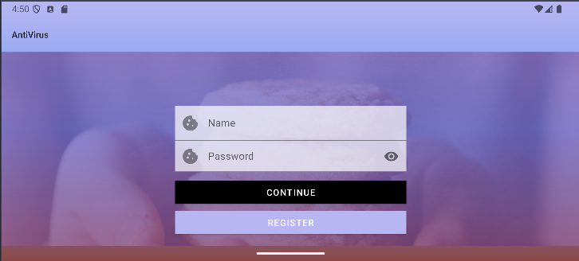
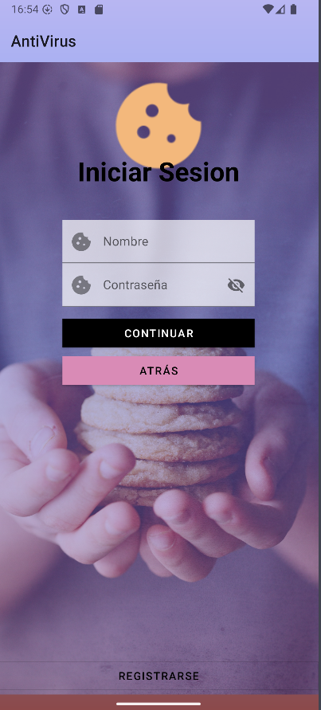
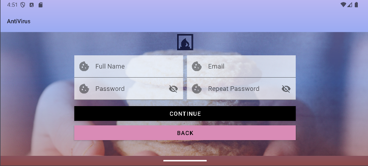
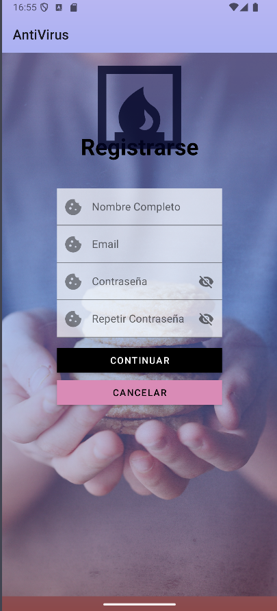
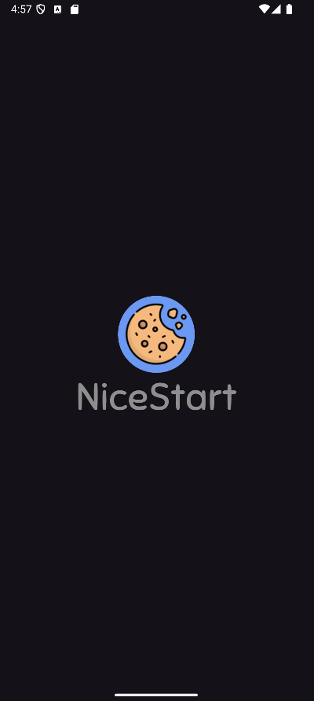
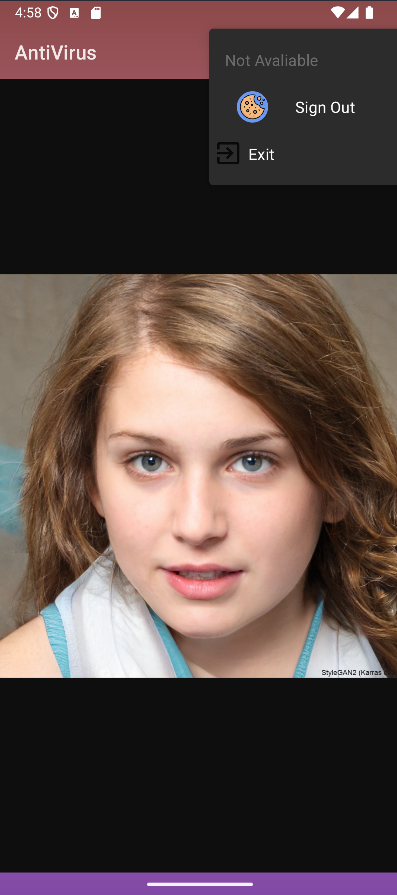
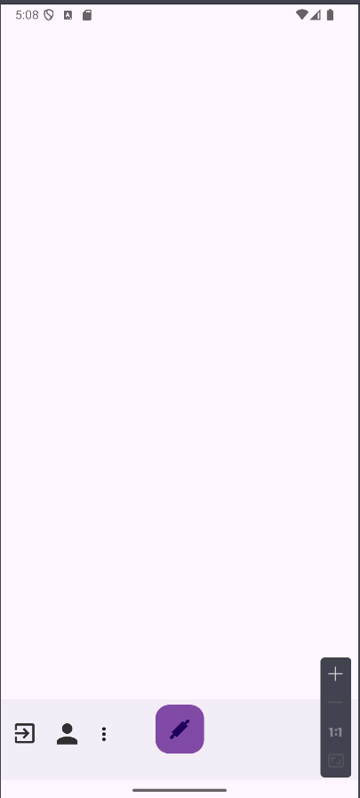
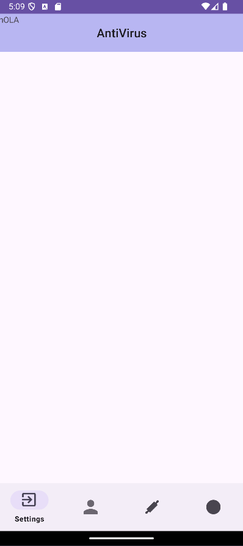

Hello Friend,
This is my very first project in AndroidStudio.
The app doesn't really work besides the buttons.

The LogIn


and its landscape view



there is an spanish version of it too




SingUp


and again the landscape view



and the spanish version



The Menu for the app was empty and boring, now this menu shows a random face from the page https://thispersondoesnotexist.com/ using a WebView

MainMenu


```
		myWeb = (WebView) findViewById(R.id.myWebView);
		WebSettings webSettings= myWeb.getSettings();
		webSettings.setLoadWithOverviewMode(true);
		webSettings.setUseWideViewPort(true);
		myWeb.loadUrl("https://thispersondoesnotexist.com/");
```

Recently added the splash screen, a load screen before the LogIn screen.
In here, I added a new blink animation to the icon, I tried to add a new font for the app

Splash


Now, if you’re wondering if there’s a dark theme, there is!





Now the splash screen has new animations, I added an overshoot animation to NiceStart and a zoom in to the logo.

Enlaces a las animaciones:
[Nice](app/src/main/res/anim/enterringht.xml)
[Start](app/src/main/res/anim/enterleft.xml)


Added a new feature, buttons in the action bar, just added a profile button, settings and a log out button.


Now if you try to exit using the button Exit a new Lottie animation pops out!!


```
public void showAlertDialogueButtonClicked(MainActivity mainAlert){

		LayoutInflater inflater = LayoutInflater.from(this);
		LinearLayout dialogView = (LinearLayout) inflater.inflate(R.layout.lottie_animation_eyeseeyou, null);
		LottieAnimationView lottieAnimationView = dialogView.findViewById(R.id.eye);


		lottieAnimationView.playAnimation();

		MaterialAlertDialogBuilder builder=new MaterialAlertDialogBuilder(MainActivity.this);
		builder.setView(dialogView);
		builder.setTitle("Eye see you");
		builder.setMessage("Don't go!!!");
		builder.setCancelable(false);

		builder.setPositiveButton("Yes", new DialogInterface.OnClickListener() {
			@Override
			public void onClick(DialogInterface dialogInterface, int i) {
				System.exit(1);
			}
		});

		builder.setNegativeButton("No", new DialogInterface.OnClickListener() {
			@Override
			public void onClick(DialogInterface dialogInterface, int i) {
				dialogInterface.dismiss();
			}
		});
		AlertDialog dialog = builder.create();
		dialog.show();
	}
```

The profile window had nothing but a cookie, and one of my friends (Vululo) modified it, now it displays like a card for the user.


There are some features that I haven't implemented directly into the app like this [BottomMenu](app/src/main/java/com/example/antivirus/MainBottomMenu.java)
and the xml [BottomMenu.xml](app/src/main/res/layout/activity_main_bottom_menu.xml)



or this [BottomNavigation](app/src/main/java/com/example/antivirus/MainBn.java)
with the xml [BottomNavigation.xml](app/src/main/res/layout/activity_main_bn.xml)




Hope you enjoy it! -_-

By KVinnyVids.
