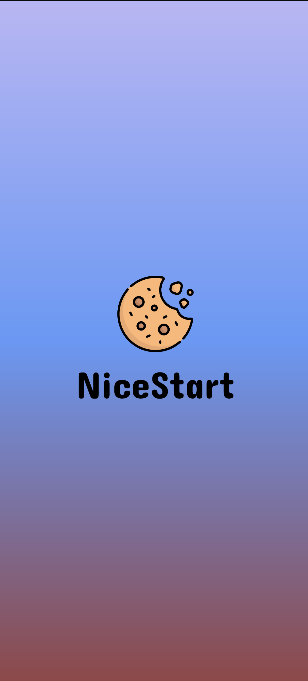
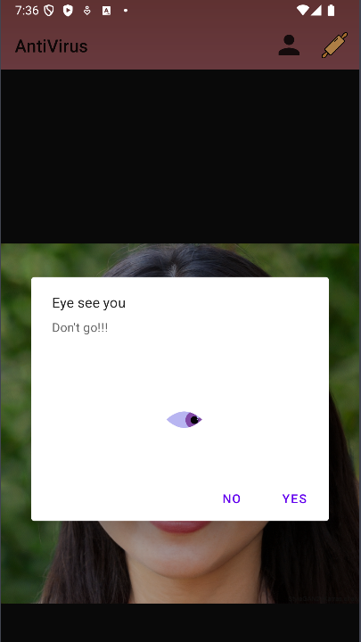

Hello Friend,
This is my very first project in AndroidStudio.
The app doesn't really work besides the buttons.

LogIn

SingUp

The Menu for the app was empty and boring, now this menu shows a random face from the page https://thispersondoesnotexist.com/ using a WebView

MainMenu

Recently added the splash screen, a load screen before the LogIn screen.
In here, I added a new blink animation to the icon, I tried to add a new font for the app

Splash

Now the splash screen has new animations, I added an overshoot animation to NiceStart and a zoom in to the logo.

Added a new feature, buttons in the action bar, just added a profile button, settings and a log out button.

Now if you try to exit using the button Exit a new Lottie animation pops out!!

The profile window had nothing but a cookie, and one of my friends (Vululo) modified it, now it displays like a card for the user.

Hope you enjoy it! -_-

By KVinnyVids.